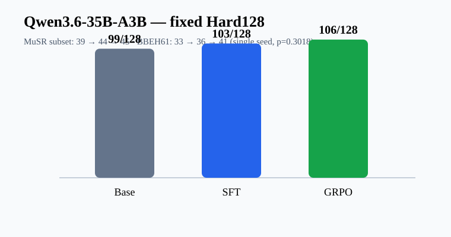

# Math Reasoning Post-training

[](https://github.com/hang154/math-reasoning-posttraining/actions/workflows/ci.yml)
[](https://github.com/hang154/math-reasoning-posttraining/releases)

Audited evidence from supervised fine-tuning and GRPO experiments across
Qwen3.6-35B-A3B, Qwen3-0.6B, and Nemotron Nano 12B v2.

Hugging Face artifacts: [Qwen 35B-class adapter](https://huggingface.co/hang010412/qwen3.6-35b-a3b-math-grpo-adapter) · [Qwen3-0.6B model](https://huggingface.co/hang010412/qwen3-0.6b-gsm8k-grpo-adapter) · [evidence dataset](https://huggingface.co/datasets/hang010412/h200-training-evidence)

> This repository is a sanitized public snapshot assembled from preserved run
> artifacts; original experiment timestamps are retained in the manifests.

## Qwen3.6-35B-A3B high-v2 line

| Stage | Hard128 | MMLU-Pro64 | MuSR64 | BBEH61 |
|---|---:|---:|---:|---:|
| Base | 99 | 60 | 39 | 33 |
| SFT | 103 | 59 | 44 | 36 |
| matched 60-step GRPO | 106 | 61 | 45 | 41 |



The BBEH61 result is a separate unseen evaluation with a documented 64k
thinking policy. It is a single-seed result; base-to-GRPO McNemar
`p=0.3018`, so it is not presented as statistically conclusive general
reasoning improvement.

The `534 train / 1 eval` entry in trainer manifests is an internal split used
for training bookkeeping, not the claimed model-selection evaluation. Model
comparison uses the separate fixed Hard128 and unseen BBEH61 suites above.

## Public training implementation

- `training/`: sanitized TRL SFT/GRPO, reward, schema-loading, and runtime code.
- `configs/`: recorded Qwen35 configurations plus the controlled Qwen3-0.6B
  SFT/GRPO settings. Local model/data paths are placeholders.
- `launch/`: four-GPU launch commands used by the Qwen35 path.
- `configs/dataset_schema.json`: interface contract; copyrighted problem rows
  are intentionally not redistributed.

## Run separation

Three Qwen35 GRPO lines are deliberately kept separate:

- Matched high-v2: 60 logged steps; source of the Hard128 table.
- Earlier run: 87 optimizer steps over 261 samples; LoRA rank 16, alpha 32.
- 32k line: 178 logged steps, 23,011.0146 seconds, 5,745,115 cumulative tokens.

Numbers from those runs must not be merged. In particular, 783 completions is
only derivable for the 87-step run, while the often-quoted 2.56M completion
tokens and 4.79 GPU-hours were not verified in preserved records.

## Qwen3-0.6B controlled reproduction

| Stage | GSM8K-100 exact | Required format |
|---|---:|---:|
| Base | 22% | 0% |
| SFT | 36% | 45% |
| GRPO | 47% | 75% |

Nemotron Nano 12B training and checkpoints are verified, but no attributable
base/SFT/GRPO improvement table was recovered; no performance claim is made.

## Validate

```bash
python scripts/verify_run_separation.py
python scripts/validate_claims.py
python scripts/plot_results.py
python -m py_compile training/*.py
```
